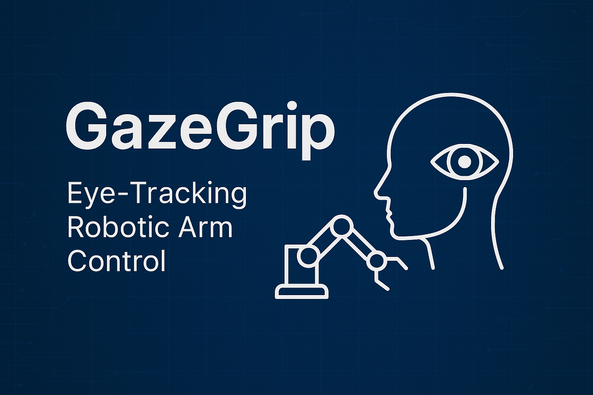

# GazeGrip



**GazeGrip** is a Python-based application designed to enable users to control mouse input using eye-tracking technology. Built with the Kivy framework, it offers a cross-platform graphical interface that translates gaze movements into cursor actions, enhancing accessibility and providing alternative interaction methods.

## Features

- **Eye-Tracking Integration**: Utilizes eye-tracking data to control mouse movements.
- **Kivy Interface**: Employs Kivy for a responsive and touch-friendly GUI.
- **Customizable Settings**: Allows users to adjust sensitivity and calibration parameters.
- **Cross-Platform Support**: Compatible with multiple operating systems via Kivy.

## Repository Structure

- `main.py`: Main application script.
- `style.kv`: Kivy layout definitions.
- `requirements.txt`: List of Python dependencies.
- `buildozer.spec`: Configuration for building mobile applications.
- `assets/`: Directory containing images and UI assets (e.g., `icon.png`, `presplash.png`, `thumbnail.png`).
- `README.md`: This file, providing an overview of the project.

## Getting Started

To set up the project locally:

1. **Clone the Repository**:
   ```bash
   git clone https://github.com/Y0J7/GazeGrip.git
   cd GazeGrip
   ```

2. **Install Dependencies**:
   Ensure you have Python installed. Then, install the required packages:
   ```bash
   pip install -r requirements.txt
   ```

3. **Run the Application**:
   ```bash
   python main.py
   ```

## Usage

1. Calibrate your eye-tracking device according to the manufacturer's instructions.
2. Launch the application to display the GUI.
3. Use your gaze to control the mouse cursor within the application.
4. Adjust settings as needed to fine-tune responsiveness.

## Contributing

Contributions are welcome! If you'd like to improve the project, please fork the repository and submit a pull request. For major changes, open an issue first to discuss your ideas.
